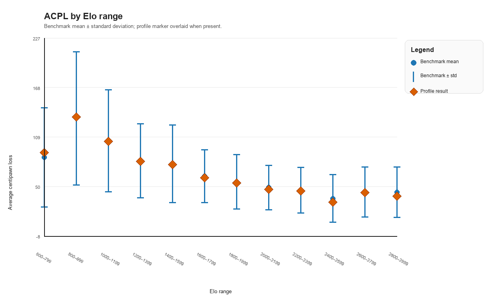
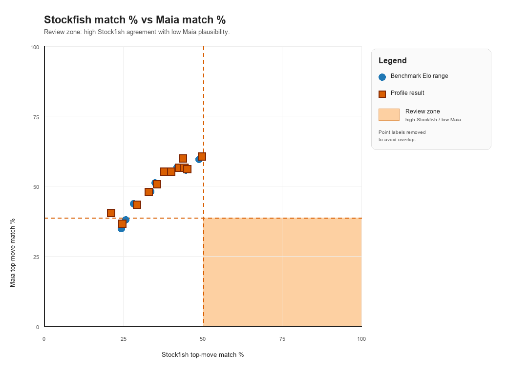

# Chess cheat-detection visualization report

Dataset kind: `standard`

This report is generated by `notebooks/reviewer_visualizations.ipynb`.
It is meant for human review of benchmark/profile outputs, not for automatic accusations.

## Available charts

### ACPL by Elo range

### Stockfish match % vs Maia match %

### Per-game timeline

Not generated yet. The selected profile JSON needs a `per_game` list. Rerun `profile` or `general_profile` after the latest code changes to save this detail.

### Phase breakdown

Not generated yet. The selected profile JSON needs `per_game[*].acpl_by_phase` and `per_game[*].top_move_pct_by_phase`.

### Move-level review table

Not generated yet. The selected profile JSON needs a `move_review` list. Rerun the profiling command after the latest code changes. Use Maia if you want the Maia predicted move column filled.

## Reading notes

- Low ACPL is strong play, but it is not suspicious by itself at high Elo.
- High Stockfish match with low Maia match is more interesting than either metric alone.
- Phase and move-level views are for reviewer triage: they show where to look, not what conclusion to draw.
- Existing older JSON files may only support summary-level charts. Rerunning the CLI with the updated code will create richer profile JSONs.
